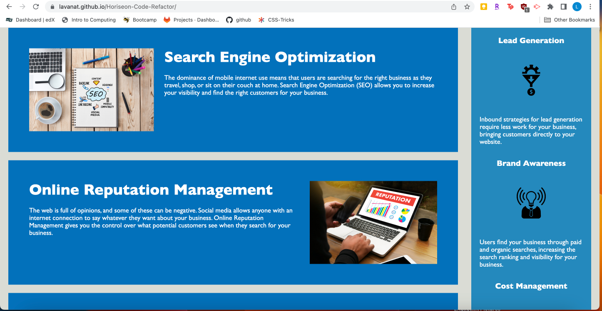

# Horiseon-Code-Refactor

## Description

This webpage was refactored to be more accessible. The images now have alternative text and the HTML and CSS files have a semantic structure. This was done as a part of the module 1 challenge for the GT Full-Stack coding bootcamp.

## Installation

N/A

## Usage

You can use this website to see an example of accessible code. This website can also be used as an example of the semantic structure of HTML code.

## Links

- Link to starter code: https://github.com/coding-boot-camp/urban-octo-telegram
- Link to Repo: https://github.com/lavanat/Horiseon-Code-Refactor
- Link to Deployed application: https://lavanat.github.io/Horiseon-Code-Refactor/

## Screenshots

Deployed Website:
- 
- 

## License

Refer to the License file in the repo.

Bootcamp module 1 challenge - refactor code to be more accessible 
